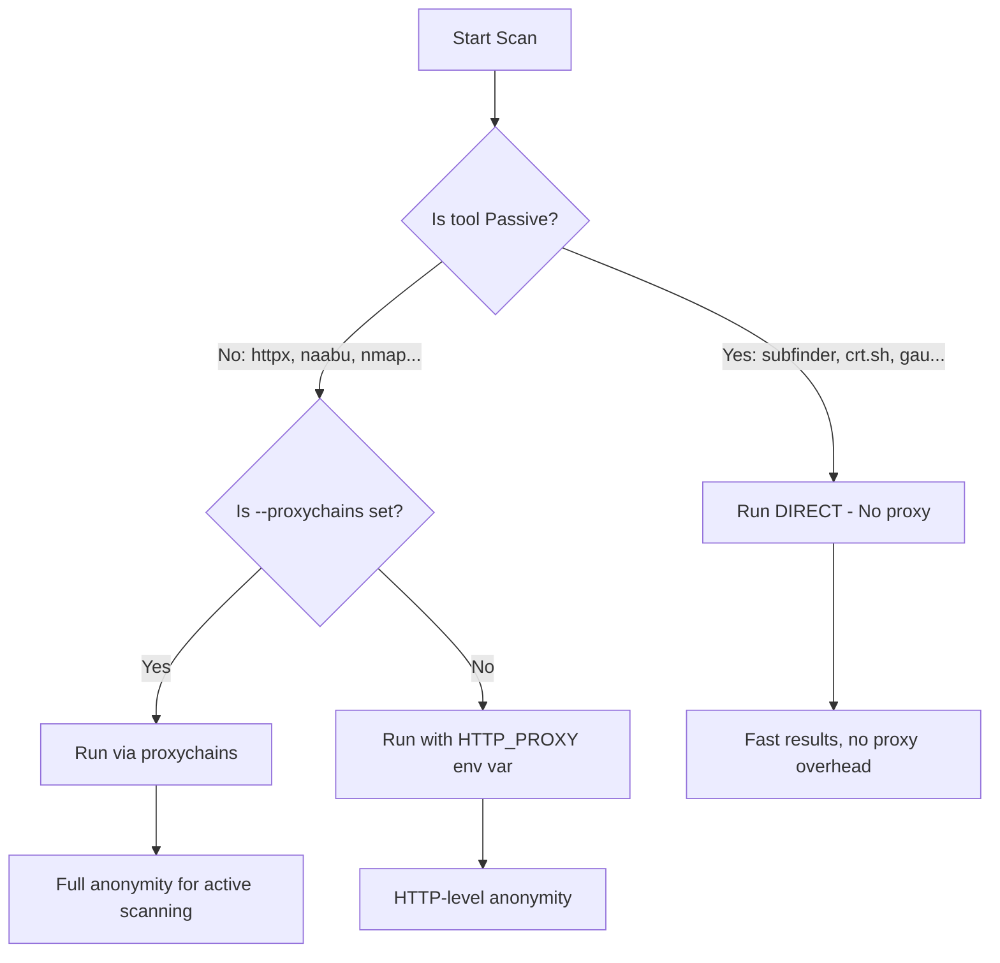

# 🔍 Clicker - Black-box Recon & Vulnerability Assessment Pipeline
**Version** `v1.2` | **Python** `3.8+` | **Platform** `Linux` | **License** `MIT`

> Automated reconnaissance pipeline for security researchers & bug hunters  
> **Follow updates:** `@403_linux`

---

## 📋 Table of Contents
- [✨ Features](#-features)
- [🔧 Requirements](#-requirements)
- [📦 Installation](#-installation)
- [🚀 Quick Start](#-quick-start)
- [⚙️ Options & Arguments](#-options--arguments)
- [🛡️ Proxy Support (NEW v1.2)](#-proxy-support-new-v14)
- [📊 Output Structure](#-output-structure)
- [📁 Project Structure](#-project-structure)
- [🛠️ API Keys Setup](#-api-keys-setup)
- [🔄 Phases Overview](#-phases-overview)
- [📝 Examples](#-examples)
- [⚠️ Disclaimer](#-disclaimer)
- [🤝 Contributing](#-contributing)
- [📄 License](#-license)

---

## ✨ Features

### 🔍 Reconnaissance
- **Passive Subdomain Enumeration**: 10+ sources (Subfinder, Sublist3r, Chaos, Assetfinder, crt.sh, WaybackURLs, GAU, etc.)
- **Active Subdomain Discovery**: Bruteforce with puredns, permutation scanning with altdns+shuffledns, DNS enumeration with dnsrecon, HTTP fallback with ffuf
- **Response Filtering**: HTTP status code filtering (200/302/403/404) with httpx
- **Technology Detection**: Stack fingerprinting, IP extraction, and CDN detection

### 🎯 Attack Surface Mapping
- **Port Scanning**: Comprehensive port discovery with naabu + service detection with nmap -sC
- **Screenshot Capture**: Visual reconnaissance with aquatone or gowitness
- **Content Discovery**: URL enumeration via waybackurls, gau, katana, waymore
- **JS Recon**: JavaScript file extraction + secret/API key detection with mantra

### 🛡️ Security Checks
- **LeakIX Integration**: Exposure check for misconfigured services & leaked data
- **Subdomain Takeover**: Detection with subzy, subjack, and nuclei takeover templates
- **WAF Detection**: Web Application Firewall identification with wafw00f (batched processing)
- **Shodan Enrichment**: IP intelligence lookup (requires API key)

### 📈 Reporting & UX
- **Multi-format Reports**: JSON, TXT, HTML, and PDF output
- **Verbose Mode**: Real-time terminal output with color-coded results
- **Smart Cleanup**: Auto-remove empty files & temporary artifacts
- **Progress Tracking**: Visual progress bars for each phase

### 🔄 Resume & Reliability (NEW v1.2)
- **Checkpoint System**: `--resume` flag to continue interrupted scans from last completed phase
- **Auto-Fallback Wordlists**: Automatically downloads `resolvers.txt` and `wordlist` if not found locally
- **Smart Error Handling**: Cascading error prevention with empty file safeguards

---

## 🔧 Requirements

### 🐍 Python Dependencies
- `python3 >= 3.8`
- `reportlab` *(Optional: for PDF reports)*

### 🛠️ External Tools (Install via package manager or Go)

| Tool | Purpose | Installation |
|------|---------|-------------|
| `subfinder` | Passive subdomain enumeration | `go install -v github.com/projectdiscovery/subfinder/v2/cmd/subfinder@latest` |
| `sublist3r` | Subdomain enumeration | `pip install sublist3r` |
| `chaos` | ProjectDiscovery subdomain DB | `go install -v github.com/projectdiscovery/chaos-client/cmd/chaos@latest` |
| `assetfinder` | Subdomain discovery | `go install github.com/tomnomnom/assetfinder@latest` |
| `github-subdomains` | GitHub subdomain search | `go install github.com/gwen001/github-subdomains@latest` |
| `findomain` | Fast subdomain finder | [Download releases](https://github.com/Edu4rdSHL/findomain/releases) |
| `waybackurls` | Archive URL extraction | `go install github.com/tomnomnom/waybackurls@latest` |
| `gau` | GetAllURLs from archives | `go install github.com/lc/gau/v2/cmd/gau@latest` |
| `httpx` / `httpx-toolkit` | HTTP probing & tech detection | `go install -v github.com/projectdiscovery/httpx/cmd/httpx@latest` |
| `naabu` | Fast port scanner | `go install -v github.com/projectdiscovery/naabu/v2/cmd/naabu@latest` |
| `dnsx` | DNS resolution & probing | `go install -v github.com/projectdiscovery/dnsx/cmd/dnsx@latest` |
| `cdncheck` | CDN/WAF detection | `go install -v github.com/projectdiscovery/cdncheck/cmd/cdncheck@latest` |
| `nmap` | Service/version detection | `sudo apt install nmap` |
| `puredns` | Accurate subdomain bruteforce | `go install github.com/d3mondev/puredns/v2@latest` |
| `altdns` | Subdomain permutation generator | `pip install py-altdns` |
| `shuffledns` | DNS bruteforce wrapper | `go install -v github.com/projectdiscovery/shuffledns/cmd/shuffledns@latest` |
| `dnsrecon` | DNS enumeration suite | `pip install dnsrecon` |
| `ffuf` | Web fuzzing toolkit | `go install github.com/ffuf/ffuf/v2/cmd/ffuf@latest` |
| `aquatone` / `gowitness` | Screenshot capture | `go install github.com/michenriksen/aquatone@latest` |
| `katana` / `waymore` | Advanced crawling | `go install github.com/projectdiscovery/katana/cmd/katana@latest` |
| `mantra` | JS secret scanner | `go install github.com/brosck/mantra@latest` |
| `subzy` / `subjack` | Subdomain takeover | `go install github.com/PentestPad/subzy@latest` |
| `wafw00f` | WAF detection | `pip install wafw00f` |
| `curl` + `jq` | API interactions | `sudo apt install curl jq` |
| `proxychains4` *(Optional)* | Route TCP tools via proxy | `sudo apt install proxychains4` |

> 💡 **Tip**: Most Go tools can be installed with `go install`. Ensure `$GOPATH/bin` is in your `PATH`.

---

## 📦 Installation

### 1️⃣ Clone the Repository
```bash
git clone https://github.com/darkzone-964/clicker.git
cd clicker
```

### 2️⃣ Install Python Dependencies (Optional)
```bash
pip3 install reportlab  # For PDF report generation
```

### 3️⃣ Install External Tools
Use the installation commands from the Requirements section above, or run:
```bash
# Quick install for Kali/Debian users
sudo apt update && sudo apt install -y nmap curl jq proxychains4

# Install Go tools (requires Go >= 1.21)
go install -v github.com/projectdiscovery/subfinder/v2/cmd/subfinder@latest
go install -v github.com/projectdiscovery/httpx/cmd/httpx@latest
# ... (repeat for other tools as needed)
```

### 4️⃣ Make Clicker Executable
```bash
chmod +x clicker.py
```

---

## 🚀 Quick Start

### 🔹 Scan a Single Target
```bash
python3 clicker.py -t example.com --verbose
```

### 🔹 Scan Multiple Targets from File
```bash
python3 clicker.py --targets-file targets.txt -v
```

### 🔹 Generate All Report Formats + PDF
```bash
python3 clicker.py -t example.com --report-format both --pdf
```

### 🔹 Skip Time-Consuming Phases
```bash
python3 clicker.py -t example.com --skip-screenshots --skip-js --skip-active-subs
```

### 🔹 Custom Wordlist & Resolvers
```bash
python3 clicker.py -t example.com \
  --wordlist /path/to/custom-wordlist.txt \
  --resolvers /path/to/custom-resolvers.txt
```

### 🔹 Resume Interrupted Scan
```bash
python3 clicker.py -t example.com --resume -v
```

### 🔹 Scan with Proxy Support
```bash
# Single manual proxy
python3 clicker.py -t example.com --proxy 1.2.3.4:8080 -v

# Auto-fetch fresh proxies + rotate per target
python3 clicker.py -t example.com --auto-proxy --rotate-proxy -v

# Hybrid mode: Passive runs direct, Active uses proxy (RECOMMENDED)
python3 clicker.py -t example.com --hybrid-proxy --auto-proxy --rotate-proxy -v

# Full proxychains routing for ALL tools (including nmap/naabu)
python3 clicker.py -t example.com --proxychains --proxy 1.2.3.4:8080 -v
```

---

## ⚙️ Options & Arguments

| Argument | Short | Description | Default |
|----------|-------|-------------|---------|
| `--target` | `-t` | Single target domain to scan | *Required if no --targets-file* |
| `--targets-file` | | File containing one domain per line | *Required if no -t* |
| `--workspace` | | Output directory for results | `clicker_output` |
| `--api-file` | | File to store/load API keys | `clicker_api.env` |
| `--report-format` | | Report format: `txt`, `html`, or `both` | `both` |
| `--pdf` | | Generate PDF report (requires reportlab) | `False` |
| `--skip-screenshots` | | Skip screenshot capture phase | `False` |
| `--skip-js` | | Skip JavaScript reconnaissance phase | `False` |
| `--skip-active-subs` | | Skip active subdomain enumeration | `False` |
| `--wordlist` | | Wordlist for active subdomain bruteforce | `/usr/share/seclists/Discovery/DNS/subdomains-top1million-20000.txt` |
| `--resolvers` | | Resolvers file for DNS queries | `/usr/share/seclists/Discovery/DNS/resolvers.txt` |
| `--keep-sources` | | Keep intermediate source files (debug mode) | `False` |
| `--show-phase-results` | | Show summary after each phase completes | `False` |
| `--verbose` | `-v` | Show full output content in terminal | `False` |
| `--resume` | | Resume scan from last checkpoint | `False` |
| `--proxy` | | Single proxy (`user:pass@IP:PORT` or `IP:PORT`) | *None* |
| `--proxy-list` | | Path to proxy list file (one `IP:PORT` per line) | *None* |
| `--auto-proxy` | | Fetch fresh proxies from public APIs automatically | `False` |
| `--rotate-proxy` | | Rotate proxies per target/domain | `False` |
| `--proxychains` | | Route ALL tools via proxychains (requires `proxychains4`) | `False` |
| `--hybrid-proxy` | | **Smart mode**: Proxy ONLY for active scanning, Passive runs directly *(RECOMMENDED)* | `False` |
| `--help` | `-h` | Show help message and exit | - |

---

## 🛡️ Proxy Support (NEW v1.2)

Clicker v1.2 introduces comprehensive proxy support with intelligent routing:

### 🔹 Proxy Modes

| Mode | Command | Behavior | Best For |
|------|---------|----------|----------|
| **Direct** | *(no flags)* | All tools connect directly | Fastest, no anonymity needed |
| **Manual Proxy** | `--proxy IP:PORT` | HTTP tools use proxy via `HTTP_PROXY` env var | Simple anonymity for HTTP requests |
| **Auto-Fetch** | `--auto-proxy` | Fetches fresh proxies from public APIs | Testing with rotating free proxies |
| **Rotate** | `--rotate-proxy` | Changes proxy per target domain | Avoiding rate limits per target |
| **Proxychains** | `--proxychains` | Wraps ALL commands (including `nmap`, `naabu`) via `proxychains4` | Full TCP/UDP anonymity |
| **Hybrid** ⭐ | `--hybrid-proxy` | **Passive tools run direct** (fast), **Active tools use proxy** (safe) | **Best balance: speed + anonymity** |

### 🔹 How Hybrid Mode Works


### 🔹 Proxy Health & Fallback
- ✅ **Auto health check**: Tests proxy connectivity before each phase
- ✅ **Smart fallback**: If a command fails with proxy, retries automatically without it
- ✅ **Environment cleanup**: Removes `HTTP_PROXY` vars for network tools to prevent conflicts

### 🔹 Example Proxy List Format (`proxies.txt`)
```
185.162.128.45:8080
user:pass@45.12.34.56:9090
socks5://127.0.0.1:1080
```

> ⚠️ **Warning**: Free public proxies are often slow, unstable, or logged. For professional use, consider paid residential/datacenter proxies.

---

## 📊 Output Structure
```
clicker_output/
├── example.com/
│   ├── passive/
│   │   ├── allsubs.txt              # All discovered subdomains (passive)
│   │   ├── active_subs.txt          # Subdomains found via active scanning
│   │   ├── allsubs_final.txt        # Merged: passive + active
│   │   ├── high_value_subs.txt      # Subdomains with sensitive prefixes
│   │   └── *_subfinder.txt          # Tool-specific outputs
│   ├── active/
│   │   ├── alive-final.txt          # Live HTTP hosts (200/302)
│   │   ├── subs-Tech.txt            # Tech stack + IP info
│   │   ├── ips.txt                  # Extracted IP addresses
│   │   ├── open-ports-full.txt      # Formatted port scan results
│   │   ├── nmap-scripts.txt         # Nmap script scan findings
│   │   └── success-response.txt     # All responsive hosts
│   ├── urls/
│   │   └── final-urls.txt           # Discovered URLs/endpoints
│   ├── js/
│   │   ├── jsfiles.txt              # Extracted JavaScript files
│   │   └── secrets-found.txt        # Potential API keys/secrets
│   ├── leakix/
│   │   ├── leakix-ips.txt           # LeakIX IP exposure findings
│   │   └── leakix-domains.txt       # LeakIX domain exposure findings
│   ├── takeover/
│   │   ├── subzy-results.txt        # Subzy takeover results
│   │   └── subjack-results.json     # Subjack takeover results
│   ├── waf/
│   │   └── waf-detected.txt         # WAF detection summary
│   └── screenshots/
│       ├── aquatone/                # Aquatone output
│       └── gowitness/               # Gowitness database
├── report.json      # Full JSON report
├── report.txt       # Human-readable TXT report
├── report.html      # Interactive HTML report
└── report.pdf       # PDF report (if --pdf used)
```

---

## 📁 Project Structure
```
clicker.py          # Main executable script
clicker_api.env     # API keys configuration (auto-generated)
CHANGELOG.md        # Version history & updates
README.md           # This documentation
```

---

## 🛠️ API Keys Setup
Clicker supports optional API integrations for enhanced results. On first run, you'll be prompted to configure:

| Key | Service | Purpose | Get Key |
|-----|---------|---------|---------|
| `CHAOS_API_KEY` | Chaos by ProjectDiscovery | Access Chaos subdomain database | [Sign up](https://chaos.projectdiscovery.io/) |
| `VT_API_KEY` | VirusTotal | Subdomain enumeration via VT API | [Get API key](https://www.virustotal.com/) |
| `GITHUB_TOKEN` | GitHub | Search GitHub for subdomains | [Create token](https://github.com/settings/tokens) |
| `SHODAN_API` | Shodan | IP intelligence & exposure data | [Get API key](https://account.shodan.io/) |
| `LEAKIX_API` | LeakIX | Exposure & misconfiguration checks | [Get API key](https://leakix.net/settings) |

🔐 **Keys are stored locally in `clicker_api.env` — never share this file.**

To manually edit keys:
```bash
nano clicker_api.env
```

---

## 🔄 Phases Overview
Clicker executes 11 sequential phases per target:

| Phase | Name | Output |
|-------|------|--------|
| `[1]` | Passive Subdomain Enumeration | `allsubs.txt` |
| `[1.5]` | Active Subdomain Enumeration | `active_subs.txt` + merge |
| `[2]` | Response Filtering | `alive-final.txt` |
| `[3]` | Technology Detection | `subs-Tech.txt` + `ips.txt` |
| `[4]` | Port Scanning | `open-ports-full.txt` + `nmap-scripts.txt` |
| `[5]` | Subdomain Takeover Detection | `takeover/subzy-results.txt` |
| `[6]` | WAF Detection | `waf/waf-detected.txt` |
| `[7]` | Screenshots | `screenshots/aquatone` or `gowitness/` |
| `[8]` | Content Discovery | `final-urls.txt` |
| `[9]` | JS Recon & Secret Discovery | `jsfiles.txt` + `secrets-found.txt` |
| `[10]` | LeakIX Exposure Check | `leakix-ips.txt` + `leakix-domains.txt` |

✅ Each phase auto-cleans empty/temporary files unless `--keep-sources` is used.  
✅ With `--resume`, completed phases are skipped on re-run.

---

## 📝 Examples

### 🔹 Basic Scan with Verbose Output
```bash
python3 clicker.py -t target.com -v
```

### 🔹 Full Scan with All Reports
```bash
python3 clicker.py -t target.com --report-format both --pdf --verbose
```

### 🔹 Fast Scan (Skip Heavy Phases)
```bash
python3 clicker.py -t target.com \
  --skip-screenshots \
  --skip-js \
  --skip-active-subs \
  --report-format txt
```

### 🔹 Hybrid Proxy Scan (RECOMMENDED)
```bash
python3 clicker.py -t target.com \
  --hybrid-proxy \
  --auto-proxy \
  --rotate-proxy \
  --verbose
```

### 🔹 Resume Interrupted Scan
```bash
# After interruption, continue from last phase:
python3 clicker.py -t target.com --resume -v
```

### 🔹 Batch Scan from File
```bash
# targets.txt contains:
# example.com
# test.example.org
# api.example.net

python3 clicker.py --targets-file targets.txt --verbose
```

### 🔹 View Results in Terminal
```bash
# View discovered subdomains
cat clicker_output/example.com/passive/allsubs_final.txt

# View potential secrets
cat clicker_output/example.com/js/secrets-found.txt

# View WAF detection summary
cat clicker_output/example.com/waf/waf-detected.txt
```

---

## ⚠️ Disclaimer

### 🔒 Educational & Authorized Use Only
- Clicker is designed for **security researchers, penetration testers, and bug bounty hunters**.
- **Always obtain explicit written permission** before scanning any target you do not own.
- Unauthorized scanning may violate laws (e.g., CFAA, GDPR, Computer Misuse Act).
- The authors assume **no liability** for misuse of this tool.

### 🌐 Proxy Usage Notice
- Using proxies does **not guarantee anonymity**; advanced targets may still detect scanning patterns.
- Free public proxies may log your traffic — use trusted providers for sensitive engagements.
- Respect rate limits of APIs and target infrastructure to avoid service disruption.

---

## 🤝 Contributing
Contributions are welcome! To contribute:

1. Fork the repository
2. Create a feature branch (`git checkout -b feature/amazing-feature`)
3. Commit your changes (`git commit -m 'Add amazing feature'`)
4. Push to the branch (`git push origin feature/amazing-feature`)
5. Open a Pull Request

### 🐛 Reporting Issues
- Use the GitHub Issues tab
- Include: OS, Python version, command used, and full error output

### 💡 Feature Requests
- Describe the use case clearly
- Suggest implementation approach if possible

---

## 📄 License
Distributed under the **MIT License**. See `LICENSE` for more information.

```
MIT License

Copyright (c) 2024 Clicker Tool (@403_linux)

Permission is hereby granted, free of charge, to any person obtaining a copy
of this software and associated documentation files (the "Software"), to deal
in the Software without restriction, including without limitation the rights
to use, copy, modify, merge, publish, distribute, sublicense, and/or sell
copies of the Software, and to permit persons to whom the Software is
furnished to do so, subject to the following conditions:

The above copyright notice and this permission notice shall be included in all
copies or substantial portions of the Software.

THE SOFTWARE IS PROVIDED "AS IS", WITHOUT WARRANTY OF ANY KIND, EXPRESS OR
IMPLIED, INCLUDING BUT NOT LIMITED TO THE WARRANTIES OF MERCHANTABILITY,
FITNESS FOR A PARTICULAR PURPOSE AND NONINFRINGEMENT. IN NO EVENT SHALL THE
AUTHORS OR COPYRIGHT HOLDERS BE LIABLE FOR ANY CLAIM, DAMAGES OR OTHER
LIABILITY, WHETHER IN AN ACTION OF CONTRACT, TORT OR OTHERWISE, ARISING FROM,
OUT OF OR IN CONNECTION WITH THE SOFTWARE OR THE USE OR OTHER DEALINGS IN THE
SOFTWARE.
```

---

> Made with ❤️ by `@403_linux`  
> **⭐ Star this repo if you find it useful!**

⬆ [Back to Top](#-clicker---black-box-recon--vulnerability-assessment-pipeline)
